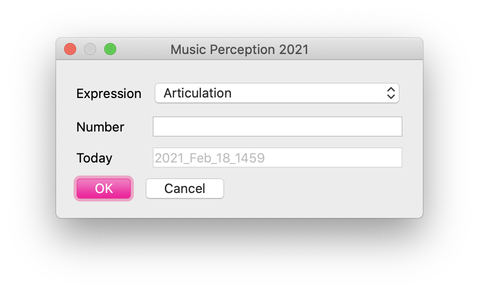

# Instruction (19/10/2020)
# PARTICIPANT RECRUITMENT:

- More than 6 years experience of musical training in any instruments
- Basic English skills
- Normal/corrected vision, normal hearing

# BEFORE PARTICIPANT ARRIVES:
1. Prepare Consent Form, Information Sheet, Receipt
2. Disinfect the keyboard and the headphone

# WHEN PARTICIPANT ARRIVES:

## Introduction
> Thank you for participating in the experiment. The aim of the experiment is to investigate whether musicians are able to recognise some differences in each performance. The experiment is going to last about one hour.

> If you have any questions or concerns, please ask the experimenter at any time about the nature of the study or the methods we are using. Also, you have the right to withdraw from the experiment at any time.

> Before we start the experiment, please read the information sheet carefully and fill it out if you agree to take part in the study.

**Collect Consent form / Information Sheet**

## Experiment

### Check the Checklist to know which condition to start!

### 1st Block
1. Double-click atsuko_experiment.sh on Desktop
2. If iTerm2 asks something, just press OK. When the programme starts, two boxes appear.

{ width=50% }

- midibox.maxpat: Max programme. Used to make midi sound (don't close this).

{ width=70% }

- dialogue box: Participant information. Please type participant number for Number and select Expression carefully depending on each participant.

3. Fill in the participant number in the dialogue box
4. Select either **articulation** or **dynamics** (check the checklist!)

### Instruction for the experiment
> Thank you very much for participating in our study. In this experiment, you are going to listen to a number of piano performances and be asked to judge whether each performance was produced in order to teach a musical expressive technique or not.

> In this block, you are going to listen to one piece with one notated musical expressive technique, which is articulation/dynamics.

- For articulation

> Articulation indicates the smoothness of sound. Legato means smooth, connected sound and staccato means sharp, shortened sound.

- For dynamics

> Dynamics indicates the loudness of sound. Forte means loud sound and piano means soft sound.

> Each performance was produced in order to either 1) teach the musical expressive technique (as a teacher) or 2) perform their best (as a performer). You will be asked to judge whether each performer had the intention to teach or not by pressing the 'Yes' < Left > or 'No' < Right > key.

...continue (follow the instruction in the experimental programme)...

#### Potential questions from participants
- What is articulation/dynamics? >> read the explanation above (but they should know this)
- How many pieces am I going to listen to? >> there is only one piece of music. However, the piece will be played with two different musical expressive techniques (either articulation or dynamics)

### 2nd Block
- Repeat the first block with **the other expression**

## Questionnaire
1. Double-click Questionnaire on Desktop
2. Fill in Participant number

> Thank you for coming today and please feel free to contact us if you have any questions about my study.

## IN CASE PROGRAMME HAS STOPPED
1. During the instruction or between trials

If there is a sentence which starts with Press < Space >, Press **ESC (Escape) key** (on the upper-left corner) to exit the programme

{ width=50% }

2. If the laptop does not accept any key, press **Option + Command + ESC keys** together. It will show Force Quit Applications.

3. None of the above works, press the power key (on the upper-right corner) to turn off the laptop.

## AFTER PARTICIPANT LEAVES:
1. Check whether data were recorded correctly (data is stored in the data folder on Desktop). If not, leave a memo on the checklist.
2. Disinfect the keyboard and the headphone

