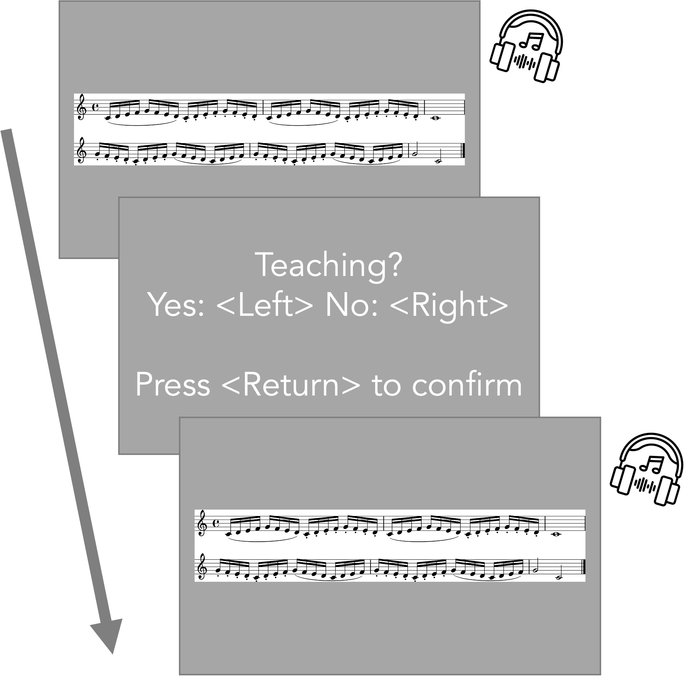

```{r set-up, include = FALSE}
# packages
if (!require("papaja")) {install.packages("papaja"); require("papaja")}
if (!require("here")) {install.packages("here"); require("here")}
if (!require("magick")) {install.packages("magick"); require("magick")}

# create image folder
if (!file.exists(here("paper/image"))){
  dir.create(here("paper/image"))
}
```

```{r function, include = FALSE}
# function to extract the overall ANOVA p-value out of a linear model object
# https://gettinggeneticsdone.blogspot.com/2011/01/rstats-function-for-extracting-f-test-p.html
lmp <- function (modelobject) {
	if (class(modelobject) != "lm") stop("Not an object of class 'lm' ")
	f <- summary(modelobject)$fstatistic
	p <- pf(f[1], f[2], f[3],lower.tail = F)
	attributes(p) <- NULL
	return(p)
}
```

# Introduction
Learning from others is one of the important elements of skill acquisition. Not only are we able to learn by observing and imitating others, but also we benefit greatly from interacting with others such as teachers and peers [@tomasello_1993]. Adults are often being pedagogical to children to explain and transmit cultural conventions [@csibra_2009]. Active teaching seems to play a crucial role not only to transit skills over generations but also to further develop sophisticated cultures, which cannot be achieved by one single individual or generation [@tennie_2009]. From a learner's perspective, it is important to identify informative teachers and infer teachers' expectations so that learners can acquire skills through interacting with teachers [@gweon_2020; @veissiere_2020].

In pedagogical settings where teachers are supposed to convey useful information to learners, it has been found that teachers often modulate their behaviour for teaching purposes. For example, adults are likely to modulate their speech and action for infants to help them acquire skills [e.g., @brand_2002; @saint-georges_2013]. Further studies have revealed that even towards adult learners, people modulate their speech and action in a similar way as they did for infants [@mcellin_2017; @uther_2007]. Moreover, @mcellin_2018 demonstrated that people could identify informative intentions such as acting with others or teaching by relying on specific kinematics cues (e.g., velocity profiles of movements). These findings suggest that experts modified their speech and action to send teaching intentions and that novices could successfully perceive the intentions.

@tominaga_2022 extended this line of research to expertise transmission where skills to be acquired are complex, such as when learning to perform with artistic expression. We investigated whether and how expert pianists communicatively modulate their performance when intending to teach the musical expressive techniques of articulation (the smoothness of sound) and dynamics (the loudness of sound). The results demonstrated that expert pianists systematically modulated their performance by playing slower or by exaggerating relevant aspects of the performance (e.g., producing shorter staccato or producing larger contrast between forte and piano) when intending to teach musical expressive techniques. Therefore, it seems that experts exhibit pedagogical behaviours to highlight crucial performance aspects for potential learners.

Here we investigated whether the modulations that expert pianists make when they intend to teach are perceived by listeners as conveying teaching intentions. We started from the assumption that listeners would be able to infer intentions from listening to recordings because previous research revealed that sound alone is sufficient to communicate different aspects of a musical performance. For instance, listeners are generally able to infer performers' intended emotions when listening to recorded performances and musically skilled listeners are even better at decoding emotions from performances [e.g., @akkermans_2019; @gabrielsson_1996].

In the present study, musicians listened to piano recordings where a musical expressive technique of either articulation or dynamics was implemented. They were asked to judge whether each recording was produced for teaching purposes or not. Half of the recordings was produced when pianists were instructed to play as if they were teaching the designated musical technique in a lesson (i.e., teaching recordings). The other half was produced when pianists were instructed to play as if they were performing it in a concert (i.e., performing recordings). First, we calculated the accuracy of participants’ judgments to examine whether they could distinguish teaching recordings from performing recordings. Furthermore, recordings were quantified with regard to tempo, articulation and dynamics. Using correlations and multiple regression analysis, we examined which modulations of performance were used to infer teaching intentions.

If performers' intentions are understood by learners with basic musical skills, they should be able to distinguish teaching recordings from performing recordings. Moreover, the same modulations of pedagogical performance parameters observed in our previous experiments such as slower demonstration and exaggerated performance, should be used to infer teaching intentions by the learners. In Experiment 1, participants listened to performances that followed simple musical scales. In Experiment 2, participants listened to performances of a more complex piece.

```{r questionnaire-1, include = FALSE}
source(here("experiment-1/analysis", "questionnaire.R"), chdir = TRUE)
```

# Experiment 1
# Methods
## Participants
We recruited `r nrow(dt)` participants who had at least six years of training in any musical instrument. They were able to read sheet music and knew two musical expressive techniques of articulation and dynamics. One participant was excluded due to an experimental error. Therefore, `r nrow(dt_included)` participants (Female: `r nrow(dt_included[Gender == "Female"])`) were included for data analysis and had `r sprintf('%.1f', mean(dt_included$Training))` years of musical training on average (*SD* = `r round(sd(dt_included$Training), 2)`). They were all right-handed with a mean age of `r sprintf('%.1f', mean(dt_included$Age))` (*SD* = `r round(sd(dt_included$Age), 2)`). All participants were recruited through an online participant platform (SONA system, https://www.sona-systems.com). The study (No. 2020/02) was approved by the Psychological Research Ethics Board (PREBO) CEU PU in Austria.

## Apparatus
The experiment was programmed in Python 3.8.2 using the PsychoPy Python library (2020.2.4; https://www.psychopy.org/) on a Mac Book Pro with Mac OS X Catalina 10.15.6. Stimuli were played using the Mido Python library (1.2.9; https://mido.readthedocs.io/en/latest/) on a Max/MSP patcher (8.1.7; https://cycling74.com/products/max). During the experiment, participants listened to the stimuli via headphones (Audio-Technica ATH-M50X).

## Stimuli
We selected stimuli from the performances obtained in our previous experiments [@tominaga_2022]. Stimuli were produced by actual pianists on a weighed Yamaha MIDI (Musical Instrument Digital Interface) digital piano and recorded as MIDI files. Multiple pianists played one piece of music with a musical expressive technique of either articulation (*Figure \ref{fig:stim1}*, A) or dynamics (*Figure \ref{fig:stim1}*, B). Articulation refers to the smoothness of sound, which is comprised of legato and staccato. Legato indicates smooth and connected sound whereas staccato indicates sharp and separate sound. Dynamics refers to the loudness of sound, which is comprised of forte and piano. Forte indicates loud sound while piano indicates soft sound. The piece was taken from "A Dozen a Day - Play with Ease in Many Keys" by Edna-Mae Burnam and modified for the experiment. The stimuli were performed at around 80 quarter-beats per minute.

In @tominaga_2022, participants were asked to perform the piece with either articulation or dynamics in two different conditions. In the teaching condition, participants were instructed to perform the piece with the designated expressive technique as if they were teaching it to students (e.g., in a lesson). In the performing condition, participants were instructed to perform the piece with the designated expressive technique as if they were performing it to an audience (e.g., in a concert). In Tominaga et al. (2022; Experiment 1), there were 453 valid performances (i.e., performances without any pitch errors) from the teaching condition and 436 valid performances from the performing condition. For the current experiment, 96 recordings were chosen from the valid performances. We randomly sampled 24 articulation recordings and 24 dynamics recordings from the teaching condition as well as 24 articulation recordings and 24 dynamics recordings from the performing condition. It is important to note that the recordings from the teaching condition did not necessarily exhibit specific features of teaching performance that we found in our previous experiments (e.g., exaggeration) since we randomly sampled the performances from multiple pianists.

## Procedure
Upon arrival, participants read the information sheet about the experiment and gave informed consent prior to participation. In the experiment, all instructions were displayed on a computer screen in front of the participants and an experimenter also explained the procedure. Participants were instructed that they were going to listen to piano recordings with one musical expressive technique of either articulation or dynamics, which were either produced as if a pianist were teaching the designated expressive technique to students (e.g., in a lesson) or as if a pianist were performing it to an audience (e.g., in a concert). In each trial, participants listened to one recording and were asked whether the recording was produced for teaching purposes or not. Participants responded by pressing either a yes (left arrow key) or no (right arrow key) button. While listening to each recording, sheet music, which corresponded to the recording, was shown on the screen in front of the participants (*Figure \ref{fig:procedure1}*). Participants were allowed to listen to each recording only once.

There were two blocks and each block only included the recordings with one musical expressive technique of either articulation or dynamics. Each block consisted of four practice trials and 48 experimental trials. Each recording was evaluated only once in the experiment. All participants completed both blocks. The order of the blocks was counterbalanced across participants. The order of the recordings was randomised within each block.

At the end of the experiment, participants filled in a questionnaire about their demographic information and their prior experience with playing musical instruments.

## Data analysis
Data processing and statistical analysis were performed in R version 4.0.5. Correlation analysis was performed with the standard *cor* function and regression models for multiple regression were fit with the standard *lm* function from the *stats* R package. Stimuli (MIDI files) were converted to numerical data in terms of time, pitch and velocity for the onset and offset of each note using the *tuneR* R package ([https://cran.r-project.org/web/packages/tuneR/tuneR.pdf](https://cran.r-project.org/web/packages/tuneR/tuneR.pdf)).

### Accuracy
First, we examined whether participants could accurately recognise the stimuli chosen from the teaching condition in Tominaga et al., (2022; Experiment 1) as teaching and the stimuli chosen from the performing condition in Tominaga et al., (2022; Experiment 1) as performing. We compared how accurate participants were against the chance level (50%). Correct responses were either pressing the yes button when listening to teaching recordings or pressing the no button when listening to performing recordings. Incorrect responses were either pressing the yes button when listening to performing recordings or pressing the no button when listening to teaching recordings.

### Correlations and multiple regression
Stimuli were quantified regarding tempo (interonset intervals; IOIs), articulation (key-overlap time; KOT), dynamics (key velocity; KV) and dynamics contrast (key velocity difference; KV-Diff) only for 16th notes. Interonset intervals are time intervals between onsets of adjacent notes. Larger IOIs indicate slower tempo while smaller IOIs indicate faster tempo. Key-overlap time is the time overlap between two adjacent notes, namely the difference between the offset time of the current note and the onset time of the ensuing note [e.g., @bresin_2000]. Positive KOT values indicate a legato style whereas negative KOT values indicate a staccato style. Key velocity is obtained from MIDI data to describe how fast a performer hit the key. Larger KV values indicate a forte style while smaller KV values indicate a piano style. Additionally, we also measured dynamics contrast where one subcomponent of the technique moves to the other (e.g., from forte to piano, from staccato to legato) to illustrate how much dynamics contrast a performer made at transition points.

To investigate the relationships between performance features (i.e., IOIs, KOT, KV, KV-Diff) and participants' judgments as teaching (i.e., what percentage of participants responded as "yes"), we first performed separate correlation analyses for each performance feature. Second, we run multiple regression that included all four performance features to examine the strongest predictor of participants' judgments as teaching. Since articulation and dynamics were comprised of two opposite directional values (i.e., legato vs. staccato, forte vs. piano), we created four separate models that included different parts of the piece. Each model considered only parts of the piece that comprised either legato, staccato, forte or piano. For articulation recordings, there were two models. The Legato model (*Figure \ref{fig:stim1}*, (1)) considered only legato parts of the performances. We entered the legato parts of KOT and KV and KV-Diff or transition points from legato to staccato. The Staccato model (*Figure \ref{fig:stim1}*, (2)) considered only staccato parts of the performances. We entered the staccato parts of KOT and KV and KV-Diff of transition points from staccato to legato. Similarly, there were two models for dynamics recordings. The Forte model (*Figure \ref{fig:stim1}*, (3)) considered only forte parts of the performances for KV and KOT, and transition points from forte to piano for KV-Diff. The Piano model (*Figure \ref{fig:stim1}*, (4)) considered only piano parts of the performances for KV and KOT, and transition points from piano to forte for KV-Diff. With regard to tempo (IOIs), there was only one value for each recording regardless of the subcomponents because tempo was consistent across the performance. Therefore, we entered the same tempo value for the Legato and Staccato models or the Forte and Piano models.

```{r stim-1, out.width = "100%", fig.cap = "\\label{fig:stim1}Stimuli. (A)Articulation. The curved line (slur) indicates legato and the dots indicate staccato. In multiple regression analysis, (1) corresponds to Legato model and (2) corresponds to Staccato model. (B)Dynamics. The symbol `f' denotes forte and the symbol `p' denotes piano. In multiple regression analysis, (3) corresponds to Forte model and (4) corresponds to Piano model. Only the parts composed of 16th notes (i.e., (1), (2), (3), (4)) were used for data analysis.", echo = FALSE}
stim_a <- image_border(image_read(here("paper/image", "stim_a.jpg")), "#FFFFFF", "120x120")
stim_d <- image_border(image_read(here("paper/image", "stim_d.jpg")), "#FFFFFF", "120x120")

# combine
img_stimuli_1 <- image_append(c(stim_a, stim_d), stack = TRUE)
img_stimuli_1
```

```{r procedure-1, fig.align="center", out.width = "50%", fig.cap = "\\label{fig:procedure1}Procedure. Participants listened to a recording via headphones while corresponding sheet music was displayed on a monitor. They were required to respond by pressing the left-arrow (yes) or right-arrow (no) key for each judgment. Headphone image from Flaticon.com.", echo = FALSE}

```

\clearpage

# Results

```{r results-1, cache = FALSE, include = FALSE}
source(here("experiment-1/analysis", "analysis.R"), chdir = TRUE)
source(here("experiment-1/analysis/prereg_analysis", "prereg_analysis.R"), chdir = TRUE)
```

All results were reported as significant at *p* < 0.05.

## Accuracy
A one sample *t*-test was performed to compare the accuracy of participants' judgments against chance level (50%). The mean percentage of correct answers [*M* = `r sprintf('%.1f', subset$Mean_Percent)`, *SD* = `r sprintf('%.2f', subset$SD_Percent)`] was significantly higher than chance (*t*(`r ttest_all$parameter`) = `r sprintf('%.2f', ttest_all$statistic)`, *p* `r if(ttest_all$p.value < 0.001){"< .001"} else {paste("= ", sub("^(-?)0.", "\\1.", sprintf('%.2f', ttest_all$p.value)))}`, cohen's *d* = `r sprintf('%.2f', coheneff_all$effsize)`).

We also performed a one sample *t*-test for each technique separately. For articulation, the mean percentage of correct answers [*M* = `r sprintf('%.1f', subset_ad[Skill == "articulation"]$Mean_Percent)`, *SD* = `r sprintf('%.2f', subset_ad[Skill == "articulation"]$SD_Percent)`] was not significantly different from chance (*t*(`r ttest_art$parameter`) = `r sprintf('%.2f', ttest_art$statistic)`, *p* `r if(ttest_art$p.value < 0.001){"< .001"} else {paste("= ", sub("^(-?)0.", "\\1.", sprintf('%.2f', ttest_art$p.value)))}`, cohen's *d* = `r sprintf('%.2f', coheneff_art$effsize)`). For dynamics, the mean percentage of correct answers [*M* = `r sprintf('%.1f', subset_ad[Skill == "dynamics"]$Mean_Percent)`, *SD* = `r sprintf('%.2f', subset_ad[Skill == "dynamics"]$SD_Percent)`] was significantly higher than chance (*t*(`r ttest_dyn$parameter`) = `r sprintf('%.2f', ttest_dyn$statistic)`, *p* `r if(ttest_dyn$p.value < 0.001){"< .001"} else {paste("= ", sub("^(-?)0.", "\\1.", sprintf('%.2f', ttest_dyn$p.value)))}`, cohen's *d* = `r sprintf('%.2f', coheneff_dyn$effsize)`). A paired *t*-test revealed that there was a significant difference between the two techniques in terms of the accuracy (*t*(`r ttest_paired$parameter`) = `r sprintf('%.2f', ttest_paired$statistic)`, *p* `r if(ttest_paired$p.value < 0.001){"< .001"} else {paste("= ", sub("^(-?)0.", "\\1.", sprintf('%.2f', ttest_paired$p.value)))}`, cohen's *d* = `r sprintf('%.2f', coheneff_paired$effsize)`), suggesting participants chose correct answers more for dynamics recordings than articulation recordings.

## Correlations
### Tempo (IOIs)
Performance tempi (IOIs) were significantly correlated with participants' judgments as teaching for both techniques (Articulation; *r(`r cor_ioi_art$parameter`)* = `r sub("^(-?)0.", "\\1.", sprintf('%.2f', cor_ioi_art$estimate))`, *p* `r if(cor_ioi_art$p.value < 0.001){"< .001"} else {paste("= ", sub("^(-?)0.", "\\1.", sprintf('%.3f', cor_ioi_art$p.value)))}`, Dynamics; *r(`r cor_ioi_dyn$parameter`)* = `r sub("^(-?)0.", "\\1.", sprintf('%.2f', cor_ioi_dyn$estimate))`, *p* `r if(cor_ioi_dyn$p.value < 0.001){"< .001"} else {paste("= ", sub("^(-?)0.", "\\1.", sprintf('%.3f', cor_ioi_dyn$p.value)))}`, *Figure \ref{fig:ioi-1}*). Participants identified slower performances as teaching.

```{r ioi-1, include = FALSE}
cor_ioi_1 <- ggscatter(ioi, x = "Mean", y = "Teaching", color = "Skill", add = "reg.line", palette = "d3", add.params = list(fill = "lightgray"), conf.int = TRUE, xlab = "IOIs (ms)", ylab = "Judged as teaching (%)") + scale_x_continuous(breaks = seq(150, 242, 20)) + labs(color = "Technique", shape = "Technique") + coord_cartesian(xlim = c(150, 242), ylim = c(0, 100)) + theme(aspect.ratio = 1) + theme_pubr(base_size = 18, base_family = "Helvetica")

# save
ggsave(here("paper/image", "cor_ioi_1.png"), plot = cor_ioi_1, dpi = 300, width = 6, height = 6)
img_cor_ioi_1 <- image_read(here("paper/image", "cor_ioi_1.png"))
```

### Articulation (KOT)
For articulation recordings, there was a significant relationship between KOT values and participants' judgments as teaching (*Figure \ref{fig:kot-1}*, left). Specifically, performances with shorter staccato (*r(`r cor_kot_sta$parameter`)* = `r sub("^(-?)0.", "\\1.", sprintf('%.2f', cor_kot_sta$estimate))`, *p* `r if(cor_kot_sta$p.value < 0.001){"< .001"} else {paste("= ", sprintf('%.3f', cor_kot_sta$p.value))}`) and longer legato (*r(`r cor_kot_leg$parameter`)* = `r sub("^(-?)0.", "\\1.", sprintf('%.2f', cor_kot_leg$estimate))`, *p* `r if(cor_kot_leg$p.value < 0.001){"< .001"} else {paste("= ", sub("^(-?)0.", "\\1.", sprintf('%.3f', cor_kot_leg$p.value)))}`) were more likely to be judged as teaching.

For dynamics recordings, there was no significant relationship between KOT values and participants' judgments as teaching (Forte; *r(`r cor_kot_for$parameter`)* = `r sub("^(-?)0.", "\\1.", sprintf('%.2f', cor_kot_for$estimate))`, *p* `r if(cor_kot_for$p.value < 0.001){"< .001"} else {paste("= ", sub("^(-?)0.", "\\1.", sprintf('%.2f', cor_kot_for$p.value)))}`, Piano; *r(`r cor_kot_for$parameter`)* = `r sub("^(-?)0.", "\\1.", sprintf('%.2f', cor_kot_pia$estimate))`, *p* `r if(cor_kot_pia$p.value < 0.001){"< .001"} else {paste("= ", sub("^(-?)0.", "\\1.", sprintf('%.2f', cor_kot_pia$p.value)))}`, *Figure \ref{fig:kot-1}*, right).

```{r kot-1, include = FALSE}
kot_all$Subcomponent <- factor(kot_all$Subcomponent, levels = c("Legato", "Staccato", "Forte", "Piano"))
cor_kot_1 <- ggscatter(kot_all, x = "Mean", y = "Teaching", color = "Subcomponent", add = "reg.line", palette = "d3", facet.by = "Skill",
          add.params = list(fill = "lightgray"), conf.int = TRUE, cor.coef = FALSE,
          xlab = "KOT (ms)", ylab = "Judged as teaching (%)") + scale_x_continuous(breaks = seq(-250, 200, 100)) + coord_cartesian(xlim = c(-250, 200), ylim = c(0, 100)) + theme(aspect.ratio = 1) + theme_pubr(base_size = 18, base_family = "Helvetica")

# save
ggsave(here("paper/image", "cor_kot_1.png"), plot = cor_kot_1, dpi = 300, width = 7, height = 5)
img_cor_kot_1  <- image_read(here("paper/image", "cor_kot_1.png"))
```

### Dynamics (KV)
For dynamics recordings, there was a significant relationship between KV values and participants' judgments as teaching (*Figure \ref{fig:vel-1}*, right). Specifically, performances with louder forte were more likely to be judged as teaching (*r(`r cor_vel_for$parameter`)* = `r sub("^(-?)0.", "\\1.", sprintf('%.2f', cor_vel_for$estimate))`, *p* `r if(cor_vel_for$p.value < 0.001){"< .001"} else {paste("= ", sub("^(-?)0.", "\\1.", sprintf('%.3f', cor_vel_for$p.value)))}`). However, there was no significant relationship between KV values for piano and participants' judgments as teaching (*r(`r cor_vel_pia$parameter`)* = `r sub("^(-?)0.", "\\1.", sprintf('%.2f', cor_vel_pia$estimate))`, *p* `r if(cor_vel_pia$p.value < 0.001){"< .001"} else {paste("= ", sub("^(-?)0.", "\\1.", sprintf('%.2f', cor_vel_pia$p.value)))}`).

For articulation recordings, there was no significant relationship between KV values and participants' judgments as teaching (Legato; *r(`r cor_vel_leg$parameter`)* = `r sub("^(-?)0.", "\\1.", sprintf('%.2f', cor_vel_leg$estimate))`, *p* `r if(cor_vel_leg$p.value < 0.001){"< .001"} else {paste("= ", sub("^(-?)0.", "\\1.", sprintf('%.2f', cor_vel_leg$p.value)))}`, Staccato; *r(`r cor_vel_sta$parameter`)* = `r sub("^(-?)0.", "\\1.", sprintf('%.2f', cor_vel_sta$estimate))`, *p* `r if(cor_vel_sta$p.value < 0.001){"< .001"} else {paste("= ", sub("^(-?)0.", "\\1.", sprintf('%.2f', cor_vel_sta$p.value)))}`, *Figure \ref{fig:vel-1}*, left).

```{r vel-1, include = FALSE}
vel_all$Subcomponent <- factor(vel_all$Subcomponent, levels = c("Legato", "Staccato", "Forte", "Piano"))
cor_vel_1 <- ggscatter(vel_all, x = "Mean", y = "Teaching", color = "Subcomponent", add = "reg.line", palette = "d3", facet.by = "Skill",
          add.params = list(fill = "lightgray"), conf.int = TRUE, cor.coef = FALSE,
          xlab = "Velocity (0-127)", ylab = "Judged as teaching (%)") + scale_x_continuous(breaks = seq(40, 100, 10)) + coord_cartesian(xlim = c(40, 100), ylim = c(0, 100)) + theme(aspect.ratio = 1) + theme_pubr(base_size = 18, base_family = "Helvetica")

# save
ggsave(here("paper/image", "cor_vel_1.png"), plot = cor_vel_1, dpi = 300, width = 7, height = 5)
img_cor_vel_1  <- image_read(here("paper/image", "cor_vel_1.png"))
```

### Dynamics contrast (KV-Diff)
For dynamics recordings, there was a significant relationship between KV difference between forte and piano and participants' judgments as teaching (*Figure \ref{fig:vel-diff-1}*, right). Specifically, performances with larger contrasts between forte and piano were more likely to be judged as teaching (From Forte to Piano; *r(`r cor_vel_diff_ftop$parameter`)* = `r sub("^(-?)0.", "\\1.", sprintf('%.2f', cor_vel_diff_ftop$estimate))`, *p* `r if(cor_vel_diff_ftop$p.value < 0.001){"< .001"} else {paste("= ", sub("^(-?)0.", "\\1.", sprintf('%.3f', cor_vel_diff_ftop$p.value)))}`, From Piano to Forte; *r(`r cor_vel_diff_ptof$parameter`)* = `r sub("^(-?)0.", "\\1.", sprintf('%.2f', cor_vel_diff_ptof$estimate))`, *p* `r if(cor_vel_diff_ptof$p.value < 0.001){"< .001"} else {paste("= ", sub("^(-?)0.", "\\1.", sprintf('%.3f', cor_vel_diff_ptof$p.value)))}`).

For articulation recordings, there was no significant relationship between KV difference between legato and staccato and participants' judgments as teaching (From Legato to Staccato; *r(`r cor_vel_diff_ltos$parameter`)* = `r sub("^(-?)0.", "\\1.", sprintf('%.2f', cor_vel_diff_ltos$estimate))`, *p* `r if(cor_vel_diff_ltos$p.value < 0.001){"< .001"} else {paste("= ", sub("^(-?)0.", "\\1.", sprintf('%.2f', cor_vel_diff_ltos$p.value)))}`, From Staccato to Legato; *r(`r cor_vel_diff_stol$parameter`)* = `r sub("^(-?)0.", "\\1.", sprintf('%.2f', cor_vel_diff_stol$estimate))`, *p* `r if(cor_vel_diff_stol$p.value < 0.001){"< .001"} else {paste("= ", sub("^(-?)0.", "\\1.", sprintf('%.2f', cor_vel_diff_stol$p.value)))}`, *Figure \ref{fig:vel-diff-1}*, left).

```{r vel-diff-1, include = FALSE}
vel_diff_all$Subcomponent <- factor(vel_diff_all$Subcomponent, levels = c("LtoS", "StoL", "FtoP", "PtoF"))
cor_vel_diff_1 <- ggscatter(vel_diff_all, x = "Mean", y = "Teaching", color = "Subcomponent", add = "reg.line", palette = "d3", facet.by = "Skill",
          add.params = list(fill = "lightgray"), conf.int = TRUE, cor.coef = FALSE,
          xlab = "Velocity Difference (-127-127)", ylab = "Judged as teaching (%)") + scale_x_continuous(breaks = seq(-35, 55, 20)) + scale_x_continuous(breaks = seq(-40, 55, 20)) + coord_cartesian(xlim = c(-40, 55), ylim = c(0, 100)) + theme(aspect.ratio = 1) + theme_pubr(base_size = 18, base_family = "Helvetica")

# save
ggsave(here("paper/image", "cor_vel_diff_1.png"), plot = cor_vel_diff_1, dpi = 300, width = 7, height = 5)
img_cor_vel_diff_1  <- image_read(here("paper/image", "cor_vel_diff_1.png"))
```

## Multiple regression
In order to further investigate which feature of performance contributed the most to participants' judgments as teaching, multiple regression analyses were conducted. Statistical model assumptions were tested using the *performance* R package [@ludecke_2021]. Since articulation and dynamics consisted of two opposite subcomponents (i.e., legato vs. staccato, forte vs. piano) and therefore cannot be summed up to represent each technique as one value, we reported four separate regression models for each subcomponent (see details in *Data analysis* and *Figure \ref{fig:stim1}*).

### Legato
A multiple regression analysis was conducted to predict participants' judgments as teaching based on performance features of tempo (IOIs), articulation (KOT for legato parts), dynamics (KV for legato parts) and dynamics contrast (KV-Diff from legato to staccato). The result of the regression indicated that the model explained `r sprintf('%.1f', summary(m1)$adj.r.squared*100)` % of the variance (*F*(`r summary(m1)$fstatistic[2]`, `r summary(m1)$fstatistic[3]`) = `r sprintf('%.1f', summary(m1)$fstatistic[1])`, *p* `r if(lmp(m1) < 0.001){"< .001"} else {paste("= ", sub("^(-?)0.", "\\1.", sprintf('%.2f', lmp(m1))))}`). It was found that tempo (IOIs; *$\beta$* = `r summary(m1)$coefficients[2]`, *p* `r if(summary(m1)$coefficients[2, 4] < 0.001){"< .001"} else {paste("= ", sprintf('%.3f', summary(m1)$coefficients[2, 4]))}`) and articulation for the legato parts (KOT; *$\beta$* = `r summary(m1)$coefficients[3]`, *p* `r if(summary(m1)$coefficients[3, 4] < 0.001){"< .001"} else {paste("= ", sub("^(-?)0.", "\\1.", sprintf('%.3f', summary(m1)$coefficients[3, 4])))}`) were significant predictors of participants' judgments as teaching.

### Staccato
A multiple regression analysis was conducted to predict participants' judgments as teaching based on performance features of tempo (IOIs), articulation (KOT for staccato parts), dynamics (KV for staccato parts) and dynamics contrast (KV-Diff from staccato to legato). The result of the regression indicated that the model explained `r sprintf('%.1f', summary(m2)$adj.r.squared*100)` % of the variance (*F*(`r summary(m2)$fstatistic[2]`, `r summary(m2)$fstatistic[3]`) = `r sprintf('%.1f', summary(m2)$fstatistic[1])`, *p* `r if(lmp(m2) < 0.001){"< .001"} else {paste("= ", sprintf('%.2f', lmp(m2)))}`). It was found that tempo (IOIs; *$\beta$* = `r summary(m2)$coefficients[2]`, *p* `r if(summary(m2)$coefficients[2, 4] < 0.001){"< .001"} else {paste("= ", sub("^(-?)0.", "\\1.", sprintf('%.3f', summary(m2)$coefficients[2, 4])))}`) and articulation for the staccato parts (KOT; *$\beta$* = `r summary(m2)$coefficients[3]`, *p* `r if(summary(m2)$coefficients[3, 4] < 0.001){"< .001"} else {paste("= ", sub("^(-?)0.", "\\1.", sprintf('%.2f', summary(m2)$coefficients[3, 4])))}`) were significant predictors of participants' judgments as teaching.

### Forte
A multiple regression analysis was conducted to predict participants' judgments as teaching based on performance features of tempo (IOIs), articulation (KOT for forte parts), dynamics (KV for forte parts) and dynamics contrast (KV-Diff from forte to piano). The result of the regression indicated that the model explained `r sprintf('%.1f', summary(m3)$adj.r.squared*100)` % of the variance (*F*(`r summary(m3)$fstatistic[2]`, `r summary(m3)$fstatistic[3]`) = `r sprintf('%.2f', summary(m3)$fstatistic[1])`, *p* `r if(lmp(m3) < 0.001){"< .001"} else {paste("= ", sub("^(-?)0.", "\\1.", sprintf('%.2f', lmp(m3))))}`). It was found that tempo (IOIs; *$\beta$* = `r summary(m3)$coefficients[2]`, *p* `r if(summary(m3)$coefficients[2, 4] < 0.001){"< .001"} else {paste("= ", sub("^(-?)0.", "\\1.", sprintf('%.3f', summary(m3)$coefficients[2, 4])))}`) and dynamics for the forte parts (KV; *$\beta$* = `r summary(m3)$coefficients[4]`, *p* `r if(summary(m3)$coefficients[4, 4] < 0.001){"< .001"} else {paste("= ", sub("^(-?)0.", "\\1.", sprintf('%.2f', summary(m3)$coefficients[4, 4])))}`) were significant predictors of participants' judgments as teaching.

### Piano
A multiple regression analysis was conducted to predict participants' judgments as teaching based on performance features of tempo (IOIs), articulation (KOT for piano parts), dynamics (KV for piano parts) and dynamics contrast (KV-Diff from piano to forte). The result of the regression indicated that the model explained `r sprintf('%.1f', summary(m4)$adj.r.squared*100)` % of the variance (*F*(`r summary(m4)$fstatistic[2]`, `r summary(m4)$fstatistic[3]`) = `r sprintf('%.1f', summary(m4)$fstatistic[1])`, *p* `r if(lmp(m4) < 0.001){"< .001"} else {paste("= ", sub("^(-?)0.", "\\1.", sprintf('%.2f', lmp(m4))))}`). It was found that tempo (IOIs; *$\beta$* = `r summary(m4)$coefficients[2]`, *p* `r if(summary(m4)$coefficients[2, 4] < 0.001){"< .001"} else {paste("= ", sub("^(-?)0.", "\\1.", sprintf('%.3f', summary(m4)$coefficients[2, 4])))}`) and dynamics contrast from piano to forte (KV-Diff; *$\beta$* = `r summary(m4)$coefficients[5]`, *p* `r if(summary(m4)$coefficients[5, 4] < 0.001){"< .001"} else {paste("= ", sub("^(-?)0.", "\\1.", sprintf('%.3f', summary(m4)$coefficients[5, 4])))}`) were significant predictors of participants' judgments as teaching.

```{r plot-ioi-1, fig.align = "center", out.width = "70%", fig.cap = "\\label{fig:ioi-1}Experiment 1: Scatter plot showing the correlation between tempo feature (IOIs) and average participants' judgments as teaching for each recording. Therefore, each dot represents each stimulus. The gray bands display the 95 percent confidence intervals."}
img_cor_ioi_1
```

```{r plot-kot-1, fig.align = "center", out.width = "70%", fig.cap = "\\label{fig:kot-1}Experiment 1: Scatter plot showing the correlation between articulation feature (KOT) and average participants' judgments as teaching for each recording. Therefore, each dot represents each stimulus. The gray bands display the 95 percent confidence intervals."}
img_cor_kot_1
```

```{r plot-vel-1, fig.align = "center", out.width = "70%", fig.cap = "\\label{fig:vel-1}Experiment 1: Scatter plot showing the correlation between dynamics feature (KV) and average participants' judgments as teaching for each recording. Therefore, each dot represents each stimulus. The gray bands display the 95 percent confidence intervals."}
img_cor_vel_1
```

```{r plot-vel-diff-1, fig.align = "center", out.width = "70%", fig.cap = "\\label{fig:vel-diff-1}Experiment 1: Scatter plot showing the correlation between dynamics contrast feature (KV-Diff) and average participants' judgments as teaching for each recording. Therefore, each dot represents each stimulus. The gray bands display the 95 percent confidence intervals. LtoS; Legato to Staccato, StoL; Staccato to Legato, FtoP; Forte to Piano, PtoF; Piano to Forte."}
img_cor_vel_diff_1
```

\clearpage

# Discussion

Experiment 1 investigated whether musicians could distinguish teaching recordings from performing recordings and which features of piano performance made them infer teaching intentions. The results demonstrated that musicians could choose correct answers above chance. Also, it was found that the accuracy of participants' judgments was better for dynamics recordings than for articulation recordings. 

Performances with slower tempo were more likely to be judged as teaching by musicians regardless of which expressive technique was implemented in the piece. For articulation recordings, performances with longer legato and shorter staccato were tended to be judged as teaching. For dynamics recordings, louder performances were more likely to be judged as teaching whereas there was no relationship between softer sound and participants' judgments as teaching. Importantly, performances with larger contrasts between forte and piano for both directions (i.e., from forte to piano, from piano to forte) were more likely to be judged as teaching. This result may suggest that dynamics contrast might be reliably used to infer teaching intentions, rather than absolute dynamics values themselves. Moreover, multiple regression analyses implied that tempo feature was the strongest predictor of participants' judgments as teaching in general whereas there were specific predictors depending on which expressive technique was implemented in the piece. These performance features were overall consistent with what expert pianists did in our previous experiments for teaching purposes. Therefore, our findings suggest that musicians may rely on generic pedagogical behaviours (e.g., slower demonstration, exaggeration) to infer teaching intentions of expert pianists when listening to recorded performances.

\clearpage

# Experiment 2

The aim of Experiment 2 was to replicate the findings in Experiment 1 with a more complex piece of music. Given the findings in Experiment 1, we predicted that slower performance would be likely to be judged as teaching regardless of which expressive technique (i.e., articulation or dynamics) was implemented. Also performances with exaggerated articulation and dynamics (in particular, longer legato and shorter staccato, larger contrasts between forte and piano) would be likely to be judged as teaching.

```{r questionnaire-2, include = FALSE}
source(here("experiment-2/analysis", "questionnaire.R"), chdir = TRUE)
```

# Methods
## Participants
We recruited `r nrow(dt)` participants who had at least six years of training in any musical instrument or singing. They were able to read sheet music and knew two musical expressive techniques of articulation and dynamics. One participant was excluded because s/he did not understand the instructions. Therefore, `r nrow(dt_included)` participants (Female: `r nrow(dt_included[Gender == "Female"])`) were included for data analysis and had `r sprintf('%.2f', mean(dt_included$Training))` years of training on average in any musical instrument or singing (*SD* = `r round(sd(dt_included$Training), 2)`). Most people were right-handed (Left; `r nrow(dt_included[Handedness == "Left"])`) with a mean age of `r sprintf('%.2f', mean(dt_included$Age))` (*SD* = `r round(sd(dt_included$Age), 2)`). As Experiment 1, all participants were recruited through the SONA system and the study (No. 2020/02) was approved by the PREBO CEU PU in Austria.

## Apparatus and procedure
The apparatus and procedure were identical to Experiment 1 except that each block consisted of four practice trials and 36 experimental trials. The number of trials was reduced due to the time constraint of the experiment.

## Stimuli
As Experiment 1, we selected stimuli from our previous experiments (Tominaga et al., 2022; Experiment 2). The excerpt was taken from ``Sonatina Op.36 (No.3) in C major" by Muzio Clementi and modified for the experiment. The excerpt was performed with either articulation (*Figure \ref{fig:stim2}*, A) or dynamics (*Figure \ref{fig:stim2}*, B). The stimuli were performed around 100 - 120 quarter-beats per minute.

For the current experiment, 72 performances were chosen from the valid performances in Tominaga et al. (2022; Experiment 2). There were 248 valid performances in the teaching condition and 256 valid performances in the performing condition. We randomly sampled 18 articulation performances and 18 dynamics performances from the teaching condition as well as 18 articulation performances and 18 dynamics performances from the performing condition. Again, it is important to note that each performance from the teaching condition did not necessarily exhibit specific features of teaching that we found in the previous experiments (e.g., exaggeration) since we randomly sampled the performances.

## Data analysis
The data analysis was almost identical to Experiment 1. Only the 8th notes with expressive notations were included for data analysis. As a result, only one 8th note in the 4th measure without any expression was not included (see *Figure \ref{fig:stim2}*).

```{r stim-2, out.width = "100%", fig.cap = "\\label{fig:stim2}Stimuli. (A)Articulation. The curved line (slur) indicates legato and the dots indicate staccato. In multiple regression analysis, (1) corresponds to Legato model and (2) corresponds to Staccato model. (B)Dynamics. The symbol `f' denotes forte and the symbol `p' denotes piano. In multiple regression analysis, (3) corresponds to Forte model and (4) corresponds to Piano model. Only the 8th notes with expressive notations (i.e., (1), (2), (3), (4)) were used for data analysis.", echo = FALSE}
stim_a_2 <- image_border(image_read(here("paper/image", "stim_a_2.jpg")), "#FFFFFF", "120x120")
stim_d_2 <- image_border(image_read(here("paper/image", "stim_d_2.jpg")), "#FFFFFF", "120x120")

# combine
img_stimuli_2 <- image_append(c(stim_a_2, stim_d_2), stack = TRUE)
img_stimuli_2
```

# Results

```{r results-2, cache = FALSE, include = FALSE}
source(here("experiment-2/analysis", "analysis.R"), chdir = TRUE)
source(here("experiment-2/analysis/prereg_analysis", "prereg_analysis.R"), chdir = TRUE)
```

All results were reported as significant at *p* < 0.05.

## Accuracy
A one sample *t*-test was performed to compare the accuracy of participants' judgments against chance level (50%). The mean percentage of correct answers [*M* = `r sprintf('%.1f', subset$Mean_Percent)`, *SD* = `r sprintf('%.2f', subset$SD_Percent)`] was significantly higher than chance (*t*(`r ttest_all$parameter`) = `r sprintf('%.2f', ttest_all$statistic)`, *p* `r if(ttest_all$p.value < 0.001){"< .001"} else {paste("= ", sub("^(-?)0.", "\\1.", sprintf('%.2f', ttest_all$p.value)))}`, cohen's *d* = `r sprintf('%.2f', coheneff_all$effsize)`).

We also performed a one sample *t*-test for each technique separately. For articulation, the mean percentage of correct answers [*M* = `r sprintf('%.1f', subset_ad[Skill == "articulation"]$Mean_Percent)`, *SD* = `r sprintf('%.2f', subset_ad[Skill == "articulation"]$SD_Percent)`] was not significantly different from chance (*t*(`r ttest_art$parameter`) = `r sprintf('%.2f', ttest_art$statistic)`, *p* `r if(ttest_art$p.value < 0.001){"< .001"} else {paste("= ", sub("^(-?)0.", "\\1.", sprintf('%.2f', ttest_art$p.value)))}`, cohen's *d* = `r sprintf('%.2f', coheneff_art$effsize)`). Also for dynamics, the mean percentage of correct answers [*M* = `r sprintf('%.1f', subset_ad[Skill == "dynamics"]$Mean_Percent)`, *SD* = `r sprintf('%.2f', subset_ad[Skill == "dynamics"]$SD_Percent)`] was not significantly different from chance (*t*(`r ttest_dyn$parameter`) = `r sprintf('%.2f', ttest_dyn$statistic)`, *p* `r if(ttest_dyn$p.value < 0.001){"< .001"} else {paste("= ", sub("^(-?)0.", "\\1.", sprintf('%.2f', ttest_dyn$p.value)))}`, cohen's *d* = `r sprintf('%.2f', coheneff_dyn$effsize)`). A paired *t*-test revealed that there was no significant difference between the two techniques in terms of the accuracy (*t*(`r ttest_paired$parameter`) = `r sprintf('%.2f', ttest_paired$statistic)`, *p* `r if(ttest_paired$p.value < 0.001){"< .001"} else {paste("= ", sub("^(-?)0.", "\\1.", sprintf('%.2f', ttest_paired$p.value)))}`, cohen's *d* = `r sprintf('%.2f', coheneff_paired$effsize)`).

## Correlations
### Tempo (IOIs)
There was a significant relationship between performance tempi (IOIs) and participants' judgments as teaching only for dynamics recordings (Articulation; *r(`r cor_ioi_art$parameter`)* = `r sub("^(-?)0.", "\\1.", sprintf('%.2f', cor_ioi_art$estimate))`, *p* `r if(cor_ioi_art$p.value < 0.001){"< .001"} else {paste("= ", sub("^(-?)0.", "\\1.", sprintf('%.2f', cor_ioi_art$p.value)))}`, Dynamics; *r(`r cor_ioi_dyn$parameter`)* = `r sub("^(-?)0.", "\\1.", sprintf('%.2f', cor_ioi_dyn$estimate))`, *p* `r if(cor_ioi_dyn$p.value < 0.001){"< .001"} else {paste("= ", sub("^(-?)0.", "\\1.", sprintf('%.2f', cor_ioi_dyn$p.value)))}`, *Figure \ref{fig:ioi-2}*). Participants tended to identify slower performances as teaching for dynamics recordings.

```{r ioi-2, include = FALSE}
cor_ioi_2 <- ggscatter(ioi, x = "Mean", y = "Teaching", color = "Skill", add = "reg.line", palette = "d3",
          add.params = list(fill = "lightgray"), conf.int = TRUE,
          xlab = "IOIs (ms)", ylab = "Judged as teaching (%)") + scale_x_continuous(breaks = seq(240, 332, 20)) + labs(color = "Technique", shape = "Technique") + coord_cartesian(xlim = c(240, 332), ylim = c(0, 100)) + theme(aspect.ratio = 1) + theme_pubr(base_size = 18, base_family = "Helvetica")

# save
ggsave(here("paper/image", "cor_ioi_2.png"), plot = cor_ioi_2, dpi = 300, width = 6, height = 6)
img_cor_ioi_2 <- image_read(here("paper/image", "cor_ioi_2.png"))
```

### Articulation (KOT)
For articulation recordings, there was no significant relationship between KOT values and participants' judgments as teaching (Legato; *r(`r cor_kot_leg$parameter`)* = `r sub("^(-?)0.", "\\1.", sprintf('%.2f', cor_kot_leg$estimate))`, *p* `r if(cor_kot_leg$p.value < 0.001){"< .001"} else {paste("= ", sub("^(-?)0.", "\\1.", sprintf('%.2f', cor_kot_leg$p.value)))}`, Staccato; *r(`r cor_kot_sta$parameter`)* = `r sub("^(-?)0.", "\\1.", sprintf('%.2f', cor_kot_sta$estimate))`, *p* `r if(cor_kot_sta$p.value < 0.001){"< .001"} else {paste("= ", sub("^(-?)0.", "\\1.", sprintf('%.2f', cor_kot_sta$p.value)))}`, *Figure \ref{fig:kot-2}*, left).

For dynamics recordings, there was no significant relationship between KOT values for forte and participants' judgments as teaching (*r(`r cor_kot_for$parameter`)* = `r sub("^(-?)0.", "\\1.", sprintf('%.2f', cor_kot_for$estimate))`, *p* `r if(cor_kot_for$p.value < 0.001){"< .001"} else {paste("= ", sub("^(-?)0.", "\\1.", sprintf('%.2f', cor_kot_for$p.value)))}`). However, there was a significant relationship between KOT values for piano and participants' judgments as teaching (*r(`r cor_kot_pia$parameter`)* = `r sub("^(-?)0.", "\\1.", sprintf('%.2f', cor_kot_pia$estimate))`, *p* `r if(cor_kot_pia$p.value < 0.001){"< .001"} else {paste("= ", sub("^(-?)0.", "\\1.", sprintf('%.2f', cor_kot_pia$p.value)))}`), suggesting that performances with staccato-style piano were more likely to be considered as teaching performance (*Figure \ref{fig:kot-2}*, right). However, this significance disappeared after removing one outlier outside of 2 standard deviations in terms of KOT values for piano.

```{r kot-2, include = FALSE}
kot_all$Subcomponent <- factor(kot_all$Subcomponent, levels = c("Legato", "Staccato", "Forte", "Piano"))
cor_kot_2 <- ggscatter(kot_all, x = "Mean", y = "Teaching", color = "Subcomponent", add = "reg.line", palette = "d3", facet.by = "Skill",
          add.params = list(fill = "lightgray"), conf.int = TRUE,
          xlab = "KOT (ms)", ylab = "Judged as teaching (%)") + scale_x_continuous(breaks = seq(-300, 150, 100)) + coord_cartesian(xlim = c(-300, 150), ylim = c(0, 100)) + theme(aspect.ratio = 1) + theme_pubr(base_size = 18, base_family = "Helvetica")

# save
ggsave(here("paper/image", "cor_kot_2.png"), plot = cor_kot_2, dpi = 300, width = 7, height = 5)
img_cor_kot_2  <- image_read(here("paper/image", "cor_kot_2.png"))
```

### Dynamics (KV)
For dynamics recordings, there was a significant relationship between KV values and participants' judgments as teaching (*Figure \ref{fig:vel-2}*, right). Specifically, performances with louder forte (*r(`r cor_vel_for$parameter`)* = `r sub("^(-?)0.", "\\1.", sprintf('%.2f', cor_vel_for$estimate))`, *p* `r if(cor_vel_for$p.value < 0.001){"< .001"} else {paste("= ", sub("^(-?)0.", "\\1.", sprintf('%.3f', cor_vel_for$p.value)))}`) and softer piano (*r(`r cor_vel_pia$parameter`)* = `r sub("^(-?)0.", "\\1.", sprintf('%.2f', cor_vel_pia$estimate))`, *p* `r if(cor_vel_pia$p.value < 0.001){"< .001"} else {paste("= ", sub("^(-?)0.", "\\1.", sprintf('%.3f', cor_vel_pia$p.value)))}`) were more likely to be judged as teaching.

For articulation recordings, there was no significant relationship between KV values and participants' judgments as teaching (Legato; *r(`r cor_vel_leg$parameter`)* = `r sub("^(-?)0.", "\\1.", sprintf('%.2f', cor_vel_leg$estimate))`, *p* `r if(cor_vel_leg$p.value < 0.001){"< .001"} else {paste("= ", sub("^(-?)0.", "\\1.", sprintf('%.2f', cor_vel_leg$p.value)))}`, Staccato; *r(`r cor_vel_sta$parameter`)* = `r sub("^(-?)0.", "\\1.", sprintf('%.2f', cor_vel_sta$estimate))`, *p* `r if(cor_vel_sta$p.value < 0.001){"< .001"} else {paste("= ", sub("^(-?)0.", "\\1.", sprintf('%.2f', cor_vel_sta$p.value)))}`, *Figure \ref{fig:vel-2}*, left).

```{r vel-2, include = FALSE}
vel_all$Subcomponent <- factor(vel_all$Subcomponent, levels = c("Legato", "Staccato", "Forte", "Piano"))
cor_vel_2 <- ggscatter(vel_all, x = "Mean", y = "Teaching", color = "Subcomponent", add = "reg.line", palette = "d3", facet.by = "Skill",
          add.params = list(fill = "lightgray"), conf.int = TRUE, cor.coef = FALSE,
          xlab = "Velocity (0-127)", ylab = "Judged as teaching (%)") + scale_x_continuous(breaks = seq(40, 100, 10)) + coord_cartesian(xlim = c(40, 100), ylim = c(0, 100)) + theme(aspect.ratio = 1) + theme_pubr(base_size = 18, base_family = "Helvetica")

# save
ggsave(here("paper/image", "cor_vel_2.png"), plot = cor_vel_2, dpi = 300, width = 7, height = 5)
img_cor_vel_2  <- image_read(here("paper/image", "cor_vel_2.png"))
```

### Dynamics contrast (KV-Diff)
For dynamics recordings, there was a significant relationship between KV difference between forte and piano and participants' judgments as teaching (*Figure \ref{fig:vel-diff-2}*, right). Specifically, performances with larger contrasts between forte and piano were more likely to be judged as teaching (From Forte to Piano; *r(`r cor_vel_diff_ftop$parameter`)* = `r sub("^(-?)0.", "\\1.", sprintf('%.2f', cor_vel_diff_ftop$estimate))`, *p* `r if(cor_vel_diff_ftop$p.value < 0.001){"< .001"} else {paste("= ", sub("^(-?)0.", "\\1.", sprintf('%.3f', cor_vel_diff_ftop$p.value)))}`, From Piano to Forte; *r(`r cor_vel_diff_ptof$parameter`)* = `r sub("^(-?)0.", "\\1.", sprintf('%.2f', cor_vel_diff_ptof$estimate))`, *p* `r if(cor_vel_diff_ptof$p.value < 0.001){"< .001"} else {paste("= ", sub("^(-?)0.", "\\1.", sprintf('%.3f', cor_vel_diff_ptof$p.value)))}`).

For articulation recordings, there was no significant relationship between KV difference between transition points from legato to staccato and participants' judgments as teaching (*r(`r cor_vel_diff_ltos$parameter`)* = `r sub("^(-?)0.", "\\1.", sprintf('%.2f', cor_vel_diff_ltos$estimate))`, *p* `r if(cor_vel_diff_ltos$p.value < 0.001){"< .001"} else {paste("= ", sub("^(-?)0.", "\\1.", sprintf('%.2f', cor_vel_diff_ltos$p.value)))}`). However, there was a significant relationship between the transition points from staccato to legato and participants' judgments as teaching (*r(`r cor_vel_diff_stol$parameter`)* = `r sub("^(-?)0.", "\\1.", sprintf('%.2f', cor_vel_diff_stol$estimate))`, *p* `r if(cor_vel_diff_stol$p.value < 0.001){"< .001"} else {paste("= ", sub("^(-?)0.", "\\1.", sprintf('%.2f', cor_vel_diff_stol$p.value)))}`), suggesting that performances with larger contrasts from staccato to legato were more likely to be considered as teaching performance (*Figure \ref{fig:vel-diff-2}*, left).

```{r vel-diff-2, include = FALSE}
vel_diff_all$Subcomponent <- factor(vel_diff_all$Subcomponent, levels = c("LtoS", "StoL", "FtoP", "PtoF"))
cor_vel_diff_2 <- ggscatter(vel_diff_all, x = "Mean", y = "Teaching", color = "Subcomponent", add = "reg.line", palette = "d3", facet.by = "Skill",
          add.params = list(fill = "lightgray"), conf.int = TRUE, cor.coef = FALSE,
          xlab = "Velocity Difference (-127-127)", ylab = "Judged as teaching (%)") + scale_x_continuous(breaks = seq(-40, 55, 20)) + coord_cartesian(xlim = c(-40, 55), ylim = c(0, 100)) + theme(aspect.ratio = 1) + theme_pubr(base_size = 18, base_family = "Helvetica")

# save
ggsave(here("paper/image", "cor_vel_diff_2.png"), plot = cor_vel_diff_2, dpi = 300, width = 7, height = 5)
img_cor_vel_diff_2  <- image_read(here("paper/image", "cor_vel_diff_2.png"))
```

## Multiple regression
As Experiment 1, we performed multiple regression analyses to further investigate which feature of performance contributed the most to participants' judgments as teaching. Again, since articulation and dynamics consisted of two opposite subcomponents (i.e., legato vs. staccato, forte vs. piano) and therefore cannot be summed up to represent each technique as one value, we reported four separate regression models for each subcomponent (see details in *Data analysis* in Experiment 1 and *Figure \ref{fig:stim2}*).

### Legato
A multiple regression analysis was conducted to predict participants' judgments as teaching based on performance features of tempo (IOIs), articulation (KOT for legato parts), dynamics (KV for legato parts) and dynamics contrast (KV-Diff from legato to staccato). The result of the regression indicated that the model explained `r sprintf('%.1f', summary(m1)$adj.r.squared*100)` % of the variance (*F*(`r summary(m1)$fstatistic[2]`, `r summary(m1)$fstatistic[3]`) = `r sprintf('%.2f', summary(m1)$fstatistic[1])`, *p* `r if(lmp(m1) < 0.001){"< .001"} else {paste("= ", sub("^(-?)0.", "\\1.", sprintf('%.2f', lmp(m1))))}`). It was found that tempo (IOIs; *$\beta$* = `r summary(m1)$coefficients[2]`, *p* `r if(summary(m1)$coefficients[2, 4] < 0.001){"< .001"} else {paste("= ", sub("^(-?)0.", "\\1.", sprintf('%.2f', summary(m1)$coefficients[2, 4])))}`), dynamics (KV; *$\beta$* = `r summary(m1)$coefficients[4]`, *p* `r if(summary(m1)$coefficients[4, 4] < 0.001){"< .001"} else {paste("= ", sub("^(-?)0.", "\\1.", sprintf('%.2f', summary(m1)$coefficients[4, 4])))}`) and dynamics contrast (KV-Diff; *$\beta$* = `r summary(m1)$coefficients[5]`, *p* `r if(summary(m1)$coefficients[5, 4] < 0.001){"< .001"} else {paste("= ", sub("^(-?)0.", "\\1.", sprintf('%.3f', summary(m1)$coefficients[5, 4])))}`) for the legato parts were articulation for the legato parts were significant predictors of participants' judgments as teaching. However, articulation (KOT; *$\beta$* = `r summary(m1)$coefficients[3]`, *p* `r if(summary(m1)$coefficients[3, 4] < 0.001){"< .001"} else {paste("= ", sub("^(-?)0.", "\\1.", sprintf('%.2f', summary(m1)$coefficients[3, 4])))}`) for the legato parts was not a significant predictor.

### Staccato
A multiple regression analysis was conducted to predict participants' judgments as teaching based on performance features of tempo (IOIs), articulation (KOT for staccato parts), dynamics (KV for staccato parts) and dynamics contrast (KV-Diff from staccato to legato). The overall model was not statistically significant ($R^{2}$ = `r sprintf('%.1f', summary(m2)$adj.r.squared*100)`, *F*(`r summary(m2)$fstatistic[2]`, `r summary(m2)$fstatistic[3]`) = `r sprintf('%.2f', summary(m2)$fstatistic[1])`, *p* `r if(lmp(m2) < 0.001){"< .001"} else {paste("= ", sub("^(-?)0.", "\\1.", sprintf('%.2f', lmp(m2))))}`).

### Forte
A multiple regression analysis was conducted to predict participants' judgments as teaching based on performance features of tempo (IOIs), articulation (KOT for forte parts), dynamics (KV for forte parts) and dynamics contrast (KV-Diff from forte to piano). The result of the regression indicated that the model explained `r sprintf('%.1f', summary(m3)$adj.r.squared*100)` % of the variance (*F*(`r summary(m3)$fstatistic[2]`, `r summary(m3)$fstatistic[3]`) = `r sprintf('%.1f', summary(m3)$fstatistic[1])`, *p* `r if(lmp(m3) < 0.001){"< .001"} else {paste("= ", sub("^(-?)0.", "\\1.", sprintf('%.2f', lmp(m3))))}`). It was found that the dynamics contrast from forte to piano (KV-Diff; *$\beta$* = `r summary(m3)$coefficients[5]`, *p* `r if(summary(m3)$coefficients[5, 4] < 0.001){"< .001"} else {paste("= ", sub("^(-?)0.", "\\1.", sprintf('%.3f', summary(m3)$coefficients[5, 4])))}`) was the only significant predictor of participants' judgments as teaching.

### Piano
A multiple regression analysis was conducted to predict participants' judgments as teaching based on performance features of tempo (IOIs), articulation (KOT for piano parts), dynamics (KV for piano parts) and dynamics contrast (KV-Diff from piano to forte). The result of the regression indicated that the model explained `r sprintf('%.1f', summary(m4)$adj.r.squared*100)` % of the variance (*F*(`r summary(m4)$fstatistic[2]`, `r summary(m4)$fstatistic[3]`) = `r sprintf('%.2f', summary(m4)$fstatistic[1])`, *p* `r if(lmp(m4) < 0.001){"< .001"} else {paste("= ", sub("^(-?)0.", "\\1.", sprintf('%.2f', lmp(m4))))}`). It was found that tempo (IOIs; *$\beta$* = `r summary(m4)$coefficients[2]`, *p* `r if(summary(m4)$coefficients[2, 4] < 0.001){"< .001"} else {paste("= ", sub("^(-?)0.", "\\1.", sprintf('%.2f', summary(m4)$coefficients[2, 4])))}`) and dynamics contrast from piano to forte (KV-Diff; *$\beta$* = `r summary(m4)$coefficients[5]`, *p* `r if(summary(m4)$coefficients[5, 4] < 0.001){"< .001"} else {paste("= ", sub("^(-?)0.", "\\1.", sprintf('%.3f', summary(m4)$coefficients[5, 4])))}`) were significant predictors of participants' judgments as teaching.

```{r plot-ioi-2, fig.align = "center", out.width = "70%", fig.cap = "\\label{fig:ioi-2}Experiment 2: Scatter plot showing the correlation between tempo feature (IOIs) and average participants' judgments as teaching for each recording. Therefore, each dot represents each stimulus. The gray bands display the 95 percent confidence intervals."}
img_cor_ioi_2
```

```{r plot-kot-2, fig.align = "center", out.width = "70%", fig.cap = "\\label{fig:kot-2}Experiment 2: Scatter plot showing the correlation between articulation features (KOT) and average participants' judgments as teaching for each recording. Therefore, each dot represents each stimulus. The gray bands display the 95 percent confidence intervals."}
img_cor_kot_2
```

```{r plot-vel-2, fig.align = "center", out.width = "70%", fig.cap = "\\label{fig:vel-2}Experiment 2: Scatter plot showing the correlation between dynamics features (KV) and average participants' judgments as teaching for each recording. Therefore, each dot represents each stimulus. The gray bands display the 95 percent confidence intervals."}
img_cor_vel_2
```

```{r plot-vel-diff-2, fig.align = "center", out.width = "70%", fig.cap = "\\label{fig:vel-diff-2}Experiment 2: Scatter plot showing the correlation between dynamics contrast features (KV-Diff) and average participants' judgment as teaching for each stimulus. The gray bands display the 95 percent confidence intervals. LtoS; Legato to Staccato, StoL; Staccato to Legato, FtoP; Forte to Piano, PtoF; Piano to Forte."}
img_cor_vel_diff_2
```

# Discussion
The aim of Experiment 2 was to replicate the results of Experiment 1 and examine how musicians would infer teaching intentions when listening to a more complex piece of music. We found that articulation (KOT) did not seem to contribute to participants’ judgments as teaching. Also, tempo (IOIs) was related to participants’ judgments as teaching for dynamics recordings only. It seems that variations in these two parameters were considered to be in the space of possible interpretations of the music and were not used as general cues to infer teaching intentions.

However, dynamics (KV) seems to continue to be used as a cue to teaching intentions despite the increased musical complexity. Particularly performances with larger contrasts between forte and piano seem to be considered as teaching. Moreover, performances with both exaggerated forte and piano were considered to be for teaching. Thus, loudness (dynamics) might be used as a reliable cue to infer teaching intentions regardless of the complexity of a musical piece.

# General Discussion

The present study investigated whether and how musicians infer pedagogical intentions by listening to piano recordings. In both Experiment 1 and 2, participants were able to choose correct answers accurately more than chance (50%). However, the results showed that the accuracy was relatively low (52.7 % in Experiment 1; 52.8 % in Experiment 2). This might be because the stimuli were randomly sampled from the teaching and performing condition in @tominaga_2022. There was great variability in the selected recordings from multiple pianists and some of them do not seem to have exhibited the characteristics of teaching performance (e.g., slower demonstration, exaggeration). A possible reason is that some participants had difficulties in situating themselves in a teaching context and therefore did not produce cues.

The reason why we randomly selected the stimuli from each condition (i.e., teaching or performing) was because all the characteristics of teaching performance (e.g., IOIs, KOT, KV) were intercorrelated and it was difficult to choose stimuli based on one single criterion. Future research should examine if musicians answer more accurately with more experimentally controlled stimuli. Another possibility for the low accuracy could be that it was difficult even for musicians to find which cues were produced for teaching when listening to one piece of music with several phrases. Future research should examine whether accuracy would be improved when listening to phrases compared to whole pieces.

To examine which features of piano performance make musicians infer pedagogical intentions, we performed correlation and multiple regression analysis. Across the two experiments, it was found that loudness, particularly larger contrasts between forte and piano, strongly contributed to participants’ judgments when listening to dynamics recordings. On the other hand, unlike what we predicted, slower performance was only considered to be for teaching for both techniques in Experiment 1 where the stimuli consisted of simple musical scales. Also, we could not find that performances with exaggerated articulation (i.e., longer legato and shorter staccato) were more likely to be judged as teaching in Experiment 2. This indicates that some characteristics of performance are not necessarily used or reliable to infer performers’ intentions when listening to musically complex pieces. Certain modulations may have been too subtle to be noticed by the participants. This would be in line with @gabrielsson_2010 who reported that tempo and loudness reign over other musical factors and seem to be easier for listeners to judge. Another possibility is that a wide range of modulations is considered as expressive in more complex pieces. This raises the possibility that it is easier to learn and teach musical expressive techniques when musical complexity is low. 

The piece used in Experiment 2 was from actual sonatinas. Although sonatina pieces are generally aimed to be simple and easy for beginner pianists to play, they add a multitude of musical properties to a performance that is not present in musical scales. Not only do performers produce their communicative intentions such as emotion, but composers can express their feelings by handling various musical notations such as melody, rhythm and harmony [@gabrielsson_2010]. In our study, most of the staccato parts of the piece used in Experiment 2 (*Figure \ref{fig:stim2}*, (2)) were comprised of the same repetitive notes. This implied that they could be only played in a staccato style. Dynamics may be more independent of the structure of the piece compared to articulation. Therefore, participants might have had difficulties in recognising teaching intentions from articulation in Experiment 2. This would imply that the ease or difficulty with which teaching intentions can be derived varies across different pieces depending on a variety of musical properties.

In the current study, we exclusively recruited musicians to explore our research questions. The reason why we recruited musicians only was because the concepts of articulation and dynamics seem to be difficult for those who don't play an instrument to understand in the current experimental settings. It would be important to investigate how complete novices perceive and infer pedagogical intentions differently from musicians, who already have some experience in playing music.

\newpage

# References

\begingroup
\setlength{\parindent}{-0in}
\setlength{\leftskip}{0in}
<div id="refs" custom-style="Bibliography"></div>

\endgroup

\newpage

# Supplementary Materials
All data is available at https://osf.io/f6nr2/.

# Acknowledgement

This research was supported by the European Research Council under the European Union’s Seventh Framework Program (FP7/2007–2013)/ERC Grant agreement no. 609819, SOMICS. We thank Fanni Takátsy for her help with data collection.
